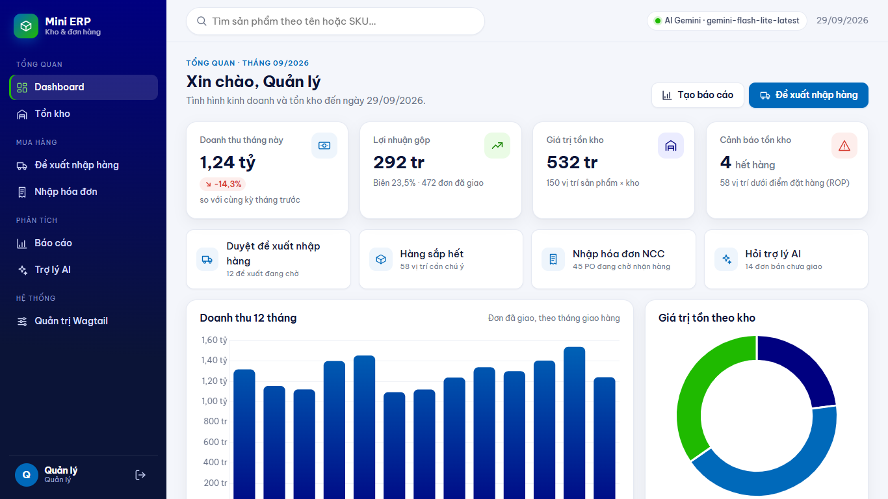

# Mini ERP – Quản lý kho & đơn hàng tích hợp AI (Wagtail CMS)

Hệ thống ERP thu nhỏ cho doanh nghiệp phân phối: danh mục, nhà cung cấp, 3 kho, đơn mua (PO), đơn bán (SO),
tồn kho và sổ kho; kết hợp OpenAI để **đề xuất nhập hàng**, **viết báo cáo định kỳ** và **trả lời câu hỏi về dữ liệu**.

Nguyên tắc: mọi con số do hệ thống tính; AI chỉ diễn giải, khuyến nghị trong biên cho phép, và luôn có phương án
dự phòng (công thức / mẫu) khi không có API key hoặc AI lỗi.

## Tính năng

| Nhóm | Nội dung |
|---|---|
| Quản trị Wagtail | Snippets cho Sản phẩm, Danh mục, NCC, Kho, Khách hàng, PO, SO (lọc, tìm kiếm, xuất CSV/Excel); trang chi tiết chứng từ với nút **Duyệt / Nhận hàng (một phần) / Xác nhận / Giao / Hủy** theo quyền; **Điều chỉnh tồn**, **Chuyển kho**; panel cảnh báo tồn kho trên trang chủ admin |
| Tồn kho | Service layer có khóa dòng, không âm kho, giữ hàng cho SO, giá vốn bình quân, sổ kho bất biến |
| F1 – Đề xuất nhập hàng | Dự báo nhu cầu (mức gần đây + mùa vụ cùng kỳ năm trước), tồn an toàn, ROP theo từng kho → AI xem lại, điều chỉnh (±30%) và giải thích → người dùng duyệt → PO nháp gom theo NCC × kho |
| F2 – Báo cáo AI | KPI kỳ (doanh thu, lợi nhuận gộp, so sánh kỳ trước, top SP, theo kho/danh mục, hàng chậm luân chuyển, PO trễ) → AI viết nhận xét → **trang Wagtail nháp + workflow duyệt** → xuất bản; tự kiểm tra số liệu AI viết |
| F3 – Trợ lý dữ liệu | Chat hỏi đáp dùng function calling trên 6 hàm tra cứu chỉ-đọc (không sinh SQL) |
| F4 – Nhập hóa đơn NCC | Tải ảnh hóa đơn → AI (vision) đọc → hệ thống khớp NCC (mã số thuế / tên) và sản phẩm (SKU / tên), cảnh báo giá lệch, tổng tiền lệch → người dùng sửa, xác nhận → PO nháp |
| Frontend `/app/` | Dashboard KPI + Chart.js, tồn kho có lọc, chi tiết sản phẩm (biểu đồ 52 tuần + dự báo + nút *Phân tích AI*), đề xuất nhập hàng, nhập hóa đơn, báo cáo, trợ lý (HTMX) |
| Phân quyền | 4 nhóm: Quản lý, Thủ kho, Mua hàng, Bán hàng (`setup_roles`) |
| Vận hành | Nhật ký gọi AI (token, thời gian, lỗi), cấu hình AI trong Wagtail Settings, scheduler hằng ngày/tuần, Docker Compose |

## Chạy nhanh

```bash
python -m venv .venv
.venv\Scripts\activate                      # macOS/Linux: source .venv/bin/activate
pip install -r requirements-dev.txt
copy .env.example .env                      # AI_PROVIDER=openai|gemini + key tương ứng (không bắt buộc)

python manage.py migrate
python manage.py seed_data --admin          # mô phỏng 400 ngày (~7 phút); thử nhanh: --days 30
python manage.py setup_roles --demo-users
python manage.py run_forecast
python manage.py generate_weekly_report --user admin
python manage.py runserver
```

| URL | |
|---|---|
| <http://localhost:8000/app/> | Ứng dụng ERP |
| <http://localhost:8000/admin/> | Quản trị Wagtail |

Tài khoản dev: `admin / admin123` (superuser); `quanly`, `thukho`, `muahang`, `banhang` / `demo12345`. Chỉ dùng cho môi trường dev.

## Lệnh quản trị

| Lệnh | Mô tả |
|---|---|
| `seed_data [--days 400] [--reset] [--admin] [--seed 42]` | Mô phỏng kinh doanh qua chính các service (mùa vụ Tết/hè/tựu trường/Trung thu, tăng trưởng, hết hàng, NCC giao trễ) |
| `setup_roles [--demo-users]` | Tạo 4 nhóm quyền, quyền trang báo cáo, thêm Quản lý vào workflow duyệt |
| `run_forecast [--date] [--no-ai]` | Dự báo, cập nhật ROP theo kho, tạo đề xuất nhập hàng, AI giải thích |
| `generate_weekly_report [--start --end] [--user] [--no-ai]` | Tạo báo cáo (mặc định tuần trước) dạng trang nháp, gửi duyệt |
| `ai_selftest` | Gọi thử từng tính năng AI với OpenAI thật (sau khi điền `OPENAI_API_KEY`) |
| `run_scheduler [--once]` | Vòng lặp chạy dự báo hằng ngày và báo cáo thứ Hai (dùng trong Docker) |

## Kiểm thử

```bash
pytest
```

93 test: service tồn kho/mua/bán, công thức dự báo, guardrail AI, client OpenAI (giả lập: JSON schema, lỗi, log),
trợ lý với tool calling, đọc & khớp hóa đơn, KPI và kiểm tra số liệu báo cáo, workflow duyệt trang, admin action theo từng vai trò,
toàn bộ trang frontend và lệnh seed. Test không gọi OpenAI thật.

## Demo

- Video (1 phút 43 giây, có phụ đề từng bước): [docs/demo/demo.mp4](docs/demo/demo.mp4)
- Ảnh chụp màn hình: [docs/screenshots/](docs/screenshots/)
- Quay lại video: `python scripts/record_demo.py --channel msedge` (xem hướng dẫn đầu file).
  Video hiện tại được quay với **Google Gemini** (`gemini-flash-lite-latest`), các màn hình AI là kết quả thật.



## Tài liệu

- [docs/ARCHITECTURE.md](docs/ARCHITECTURE.md) – kiến trúc, ERD, luồng nghiệp vụ, thiết kế AI, công thức dự báo, phân quyền
- [docs/DEPLOY.md](docs/DEPLOY.md) – biến môi trường, local, Docker Compose, VPS/PaaS, chi phí & an toàn AI
- [docs/USER_GUIDE.md](docs/USER_GUIDE.md) – hướng dẫn theo vai trò
- [docs/DEMO_SCRIPT.md](docs/DEMO_SCRIPT.md) – kịch bản demo 5 phút

## Công nghệ

Python 3.11+ (đã chạy với 3.14) · Django 6.1 · Wagtail 8.0 · SQLite / PostgreSQL · OpenAI Chat Completions hoặc Google Gemini
(qua endpoint tương thích OpenAI; JSON schema, function calling, vision) · HTMX · Chart.js · WhiteNoise · Gunicorn · Docker Compose · pytest

## Cấu trúc

```
erp/          settings (base/dev/production), urls, base template, CSS
core/         model gốc, exceptions, mã chứng từ, quyền chỉ-xem, admin actions, lệnh seed/roles/scheduler
catalog/      Product, Category, Supplier, Warehouse, Customer
inventory/    StockLevel, StockMovement, services, điều chỉnh/chuyển kho
purchasing/   PurchaseOrder(+Line), services, trang chi tiết & nhận hàng
sales/        SalesOrder(+Line), services, trang chi tiết
forecast/     engine (công thức), DemandForecast, ReorderSuggestion, run_forecast
ai/           AISettings, AICallLog, client OpenAI, prompts, services (F1/F2), assistant (F3)
reports/      KPI, ReportIndexPage / AIReportPage, generate_weekly_report
dashboard/    frontend /app/, panel admin
scripts/      record_demo.py (quay video demo bằng Playwright)
tests/        pytest
docs/         tài liệu, video demo, ảnh chụp màn hình
```
