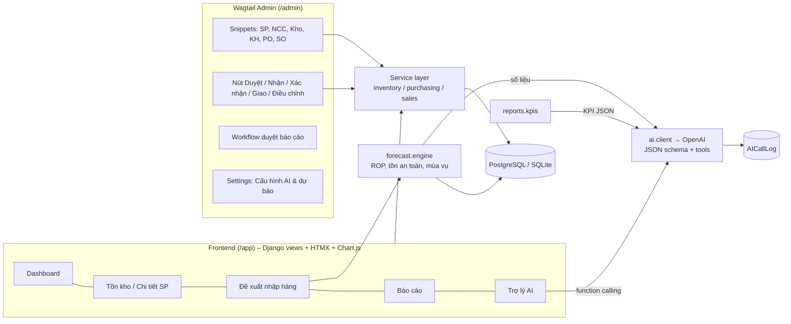
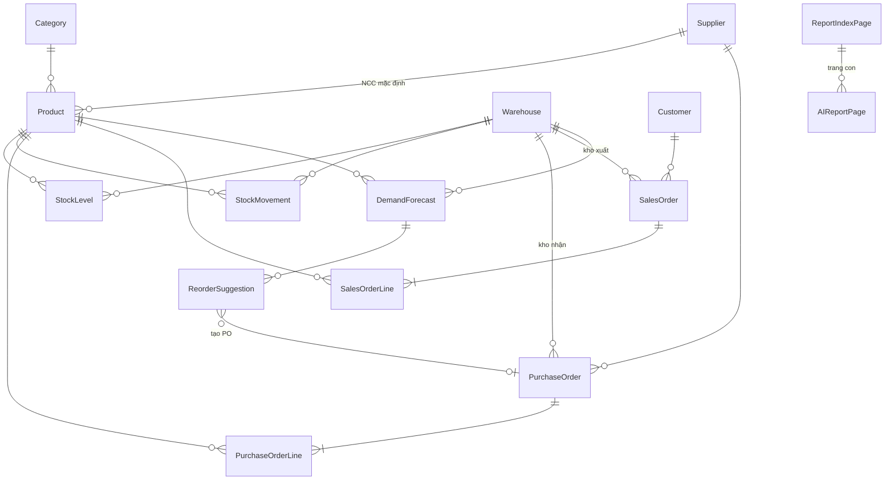
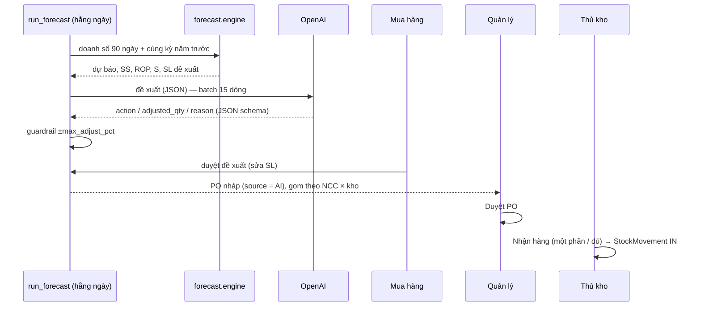

# Kiến trúc hệ thống

## 1. Tổng quan



**Nguyên tắc:** mọi con số (tồn kho, dự báo, số lượng đặt, KPI) do code tính; AI chỉ diễn giải, khuyến nghị
và luôn có phương án dự phòng khi AI không khả dụng.

## 2. Ứng dụng (Django apps)

| App | Vai trò |
|---|---|
| `core` | Model gốc, exceptions, sinh mã chứng từ, permission policy chỉ-xem, action admin dùng chung, lệnh `seed_data`, `setup_roles`, `run_scheduler` |
| `catalog` | Category, Product, Supplier, Warehouse, Customer |
| `inventory` | StockLevel, StockMovement, `services.py` (nhập/xuất/giữ/điều chỉnh/chuyển kho), form điều chỉnh & chuyển kho trong admin |
| `purchasing` | PurchaseOrder(+Line), duyệt / nhận hàng (một phần) / hủy, `invoice.py` (khớp hóa đơn NCC → PO nháp) |
| `sales` | SalesOrder(+Line), xác nhận (giữ hàng) / giao / hủy |
| `forecast` | `engine.py` (thuần tính toán), DemandForecast, ReorderSuggestion, `run_forecast`, duyệt đề xuất → PO |
| `ai` | AISettings (Wagtail Settings), AICallLog, `client.py` (OpenAI), `prompts.py`, `services.py` (F1, F2, phân tích SP), `assistant.py` (F3) |
| `reports` | `kpis.py`, ReportIndexPage / AIReportPage (Wagtail Page + StreamField), `generate_weekly_report` |
| `dashboard` | Giao diện người dùng `/app/`, panel cảnh báo trên trang chủ admin |

## 3. Mô hình dữ liệu



Các trường chính:

- **StockLevel**: `on_hand`, `reserved`, `avg_cost` (bình quân gia quyền), `reorder_point`, `safety_stock` theo kho.
  Ràng buộc DB: `on_hand ≥ 0`, `reserved ≥ 0`, `reserved ≤ on_hand`, duy nhất (product, warehouse).
- **StockMovement**: sổ kho bất biến, `quantity` có dấu, `balance_after`, `reference` (số chứng từ), `occurred_at`.
- **PurchaseOrder**: DRAFT → APPROVED → PARTIAL / RECEIVED, CANCELLED; `source` = MANUAL / AI / INVOICE_OCR.
- **SalesOrder**: DRAFT → CONFIRMED (giữ hàng) → SHIPPED, CANCELLED.
- **DemandForecast**: kết quả mỗi lần chạy cho từng SP × kho (dự báo/ngày, hệ số mùa vụ, SS, ROP, S, số ngày hết hàng, doanh số 12 tuần).
- **ReorderSuggestion**: SL hệ thống, khuyến nghị AI (`ai_action`, `ai_adjusted_qty`, `ai_confidence`, `ai_reason`, `ai_flagged`), trạng thái duyệt, PO tạo ra.
- **AIReportPage**: kỳ báo cáo, `kpi_json` (số liệu hệ thống), `body` (StreamField), `generated_by_ai`, `ai_warnings`.
- **AICallLog**: tính năng, model, token vào/ra, thời gian, lỗi, trích yêu cầu/phản hồi, người dùng.

## 4. Luồng nghiệp vụ



- **Bán hàng**: SO Nháp → Xác nhận (kiểm tra & giữ hàng, thất bại thì rollback toàn đơn) → Giao (xuất kho) → Đã giao.
- **Báo cáo**: `compute_kpis` → AI viết (JSON: summary, highlights, risks, recommendations) → kiểm tra số liệu
  → tạo AIReportPage nháp → Wagtail Workflow "Moderators approval" (nhóm Quản lý được thêm vào) → xuất bản.

## 5. Thiết kế AI

| Tính năng | Đầu vào (do hệ thống tính) | Đầu ra (JSON schema, strict) | Kiểm soát |
|---|---|---|---|
| F1 Đề xuất nhập hàng | Doanh số 12 tuần, TB 90/28 ngày, hệ số mùa vụ, lead time, SS, ROP, tồn, đang về, số ngày hết hàng, SL đề xuất | `action`, `adjusted_qty`, `confidence`, `reason` | Guardrail: lệch quá `max_adjust_pct` (mặc định 30%) → giữ số hệ thống, gắn cờ "Cần xem lại"; người dùng duyệt cuối |
| Phân tích sản phẩm | Dự báo gần nhất các kho | `summary`, `actions[]`, `risk_level` | Không có AI → tóm tắt theo công thức |
| F2 Báo cáo | Bộ KPI (doanh thu, giá vốn, lợi nhuận gộp, so sánh kỳ trước, top SP, theo kho/danh mục, tồn kho, hàng chậm luân chuyển, PO trễ) | `summary`, `highlights[]`, `risks[]`, `recommendations[]` | Hậu kiểm: mọi số (≥100, %, "tỷ/triệu") trong văn bản phải khớp KPI (sai số 2% / 0,6 điểm %); sai thì ghi `ai_warnings`; bảng KPI hiển thị từ `kpi_json`; bắt buộc qua workflow duyệt |
| F4 Hóa đơn NCC | Ảnh JPG/PNG/WebP/GIF ≤ 5 MB (gửi dạng data URL) | `supplier_name`, `supplier_tax_code`, `invoice_number`, `invoice_date`, `lines[{sku,name,quantity,unit_price}]`, `total_amount`, `note` | AI chỉ đọc; khớp NCC/sản phẩm bằng code (mã số thuế, SKU, độ tương đồng tên ≥ 0,55); cảnh báo đơn giá lệch >20% so với giá nhập và tổng tiền lệch >1%; người dùng xác nhận từng dòng; chỉ tạo PO **nháp** (source = INVOICE_OCR); ảnh không được lưu, log không chứa ảnh |
| F3 Trợ lý | Câu hỏi + lịch sử (10 lượt) | Function calling: `get_stock`, `sales_summary`, `top_products`, `low_stock_items`, `purchase_orders`, `reorder_suggestions` | Không sinh SQL; tối đa 5 vòng gọi tool; chỉ đọc |

- **Client** (`ai/client.py`): Chat Completions API, `response_format=json_schema (strict)`, timeout 60 s, retry 2 lần,
  log mọi lần gọi vào `AICallLog`. Thiếu `OPENAI_API_KEY` hoặc tắt trong Settings → `AIUnavailable`; lỗi API / JSON sai → `AIError`.
- **Cấu hình** (Wagtail Settings → *Cấu hình AI & dự báo*): bật/tắt từng tính năng, model, temperature, biên điều chỉnh,
  mức phục vụ (z), chu kỳ xem xét, số ngày lịch sử. API key chỉ đọc từ biến môi trường.
- **Prompt**: `ai/prompts.py`, có `PROMPT_VERSION`; system prompt tiếng Việt, yêu cầu không bịa số.

## 6. Phương pháp dự báo

```
level        = 0,6 × TB(28 ngày gần nhất) + 0,4 × TB(90 ngày)
mùa vụ       = TB(cùng kỳ năm trước, horizon = lead time + chu kỳ xem xét) / TB(28 ngày trước đó năm trước)
               (cần ≥ 393 ngày lịch sử; giới hạn 0,3–3; hàng bắt đầu mùa từ 0 → dùng mức năm trước)
dự báo/ngày  = level × mùa vụ
SS           = z × σ(ngày) × mùa vụ × √lead time          (z từ mức phục vụ, 95% → 1,645)
ROP          = dự báo/ngày × lead time + SS
S            = dự báo/ngày × (lead time + chu kỳ xem xét) + SS
SL đề xuất   = S − (khả dụng + đang về)   khi khả dụng + đang về ≤ ROP
```

Giới hạn đã biết: nhu cầu đo bằng đơn đã xác nhận/giao nên ngày hết hàng làm nhu cầu bị thấp (hệ thống đếm
`stockout_days` và đưa cho AI để cân nhắc); chưa tính MOQ / quy cách đóng gói của NCC.

## 7. Phân quyền

| Nhóm | Quyền chính |
|---|---|
| Quản lý | Toàn bộ danh mục, duyệt/hủy PO, nhận hàng, xác nhận/giao SO, điều chỉnh kho, duyệt đề xuất, chạy dự báo, tạo & xuất bản báo cáo, cấu hình AI, xem log AI |
| Thủ kho | Xem danh mục/đơn, nhận hàng PO, xuất kho giao SO, điều chỉnh/chuyển kho |
| Mua hàng | Sản phẩm, NCC, tạo/sửa PO nháp, xem & duyệt đề xuất nhập hàng (tạo PO nháp), chạy dự báo |
| Bán hàng | Khách hàng, tạo/sửa/xác nhận SO |

Toàn bộ `/app/` và cây trang báo cáo (`/bao-cao/`, dùng PageViewRestriction của Wagtail) yêu cầu đăng nhập.
Tồn kho, sổ kho, dự báo, đề xuất và log AI là **chỉ xem** trong admin (ReadOnlyPermissionPolicy). Chỉ chứng từ Nháp
mới sửa/xóa được; chứng từ khác mở ra sẽ chuyển tới trang chi tiết có các nút thao tác theo quyền.
